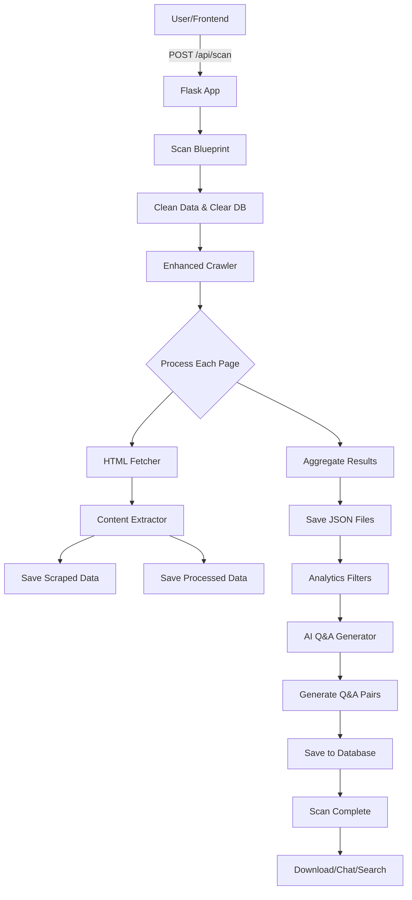

# Chatify 🤖

**An AI-powered chatbot creation platform that transforms any website into an intelligent conversational assistant**

Chatify crawls websites or processes local HTML files, extracts their content and structure, and automatically generates smart chatbots trained on your content. Perfect for creating customer support bots, documentation assistants, or knowledge base chatbots from any website.


## ✨ Features

- **🤖 Instant Chatbot Creation** - Transform any website into a smart chatbot in minutes
- **🌐 Website & Local File Processing** - Process any website URL or local HTML file
- **🔍 Intelligent Content Crawling** - Multi-threaded crawler explores all internal links and pages
- **📝 Smart Content Extraction** - Extracts and processes text, code blocks, and page structure
- **🧠 AI-Powered Training** - Uses OpenAI (default) or other AI models to train your chatbot
- **💬 Ready-to-Use Chatbot** - Instantly chat with your newly created bot
- **🔍 Smart Search** - Advanced search through your website's content
- **💾 Export & Integration** - Download training data or integrate via API
- **🎨 Modern Interface** - Clean, responsive web interface for easy chatbot creation
- **⚡ Real-time Training** - Watch your chatbot learn from your content in real-time

## 🏗️ Architecture



## 🚀 Getting Started

### Prerequisites

- **Python 3.8+**
- **OpenAI API Key** (set as `OPENAI_API_KEY` environment variable)
- Modern web browser

### 🔧 Installation

1. **Clone the repository**
   ```bash
   git clone https://github.com/Alokbpandey/Chatify.git
   cd Chatify
   ```

2. **Backend Setup**
   ```bash
   cd backend
   pip install -r requirements.txt
   
   # Set your OpenAI API key
   export OPENAI_API_KEY="your-api-key-here"
   
   # Start the backend server
   python app.py
   ```

3. **Frontend Setup**
   ```bash
   cd frontend
   # Open index.html in your browser or serve with a local server
   open index.html
   ```

### 🎯 Usage

1. **Open Chatify** in your web browser
2. **Enter your website URL** or select local HTML files to process
3. **Click "Create Chatbot"** to start the automated training process
4. **Monitor progress** as Chatify crawls, processes, and trains your bot
5. **Start chatting** with your new AI assistant trained on your content
6. **Test and refine** using the built-in chat interface
7. **Deploy and integrate** your chatbot wherever you need it

## 📁 Project Structure

```
Chatify/
├── backend/
│   ├── app.py                 # Main Flask application
│   ├── scan_routes.py         # Scanning API endpoints
│   ├── crawler.py             # Web crawling logic
│   ├── fetcher.py             # HTML fetching utilities
│   ├── extractor.py           # Content extraction
│   ├── data_handler.py        # Data processing and storage
│   ├── ai.py                  # AI Q&A generation
│   ├── analytics/
│   │   └── filters.py         # Data cleaning and filtering
│   └── chatbot/
│       └── api.py             # Chatbot API endpoints
├── frontend/
│   ├── index.html             # Main UI
│   ├── styles.css             # Styling
│   └── script.js              # Frontend logic
└── requirements.txt           # Python dependencies
```

## 🔄 How It Works

1. **Input Your Website** - Enter any website URL or upload local HTML files
2. **Automatic Content Processing** - Chatify crawls and intelligently extracts all relevant content
3. **AI Training Process** - Advanced AI models analyze and learn from your website's information
4. **Chatbot Generation** - Your custom chatbot is created with knowledge of your entire website
5. **Instant Deployment** - Start chatting immediately or integrate the bot into your applications
6. **Continuous Learning** - Add more content anytime to expand your chatbot's knowledge

## 🛠️ API Endpoints

| Endpoint | Method | Description |
|----------|--------|-------------|
| `/api/create-bot` | POST | Create a new chatbot from website content |
| `/api/chat` | POST | Interact with your trained chatbot |
| `/api/search` | GET | Search through chatbot's knowledge base |
| `/api/bot-status` | GET | Check chatbot training progress |
| `/api/download/training-data` | GET | Download chatbot training data |
| `/api/integrate` | GET | Get integration code for your chatbot |

## 🔮 Future Enhancements

- **🎯 Advanced Chatbot Customization** - Custom personalities, response styles, and behavior patterns
- **🔗 Easy Integration Options** - WordPress plugins, React components, and REST API
- **📊 Analytics Dashboard** - Track chatbot performance, user interactions, and popular queries
- **🌍 Multi-Language Chatbots** - Create chatbots that understand and respond in multiple languages
- **🤖 Multiple AI Model Support** - Choose from OpenAI, Anthropic Claude, Google Gemini, and more
- **👥 Team Collaboration** - Share and manage chatbots with team members
- **☁️ Cloud Deployment** - One-click deployment to major cloud platforms
- **🔄 Auto-Updates** - Chatbots automatically learn from website changes
- **💼 White-Label Solutions** - Custom branding and embedding options

## 🤝 Contributing

We welcome contributions! Here's how you can help:

1. **Fork** the repository
2. **Create** a feature branch (`git checkout -b feature/amazing-feature`)
3. **Commit** your changes (`git commit -m 'Add amazing feature'`)
4. **Push** to the branch (`git push origin feature/amazing-feature`)
5. **Open** a Pull Request

For major changes, please open an issue first to discuss your proposed modifications.

## 📝 License

This project is licensed under the MIT License - see the [LICENSE](LICENSE) file for details.

## 🙏 Acknowledgements

- **OpenAI** - For powerful AI-driven Q&A generation capabilities
- **Flask** - Lightweight and flexible web framework
- **Beautiful Soup** - HTML parsing and web scraping
- **SQLite** - Reliable embedded database solution
- **Requests** - HTTP library for Python

---

<div align="center">

**Made with ❤️ by [Alok Pandey](https://github.com/Alokbpandey)**

⭐ Star this repo if you find it helpful!

</div>
